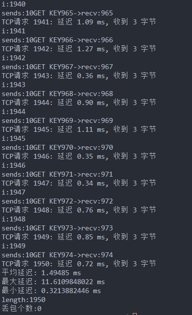
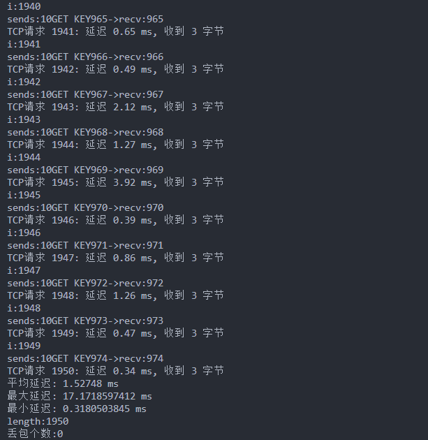
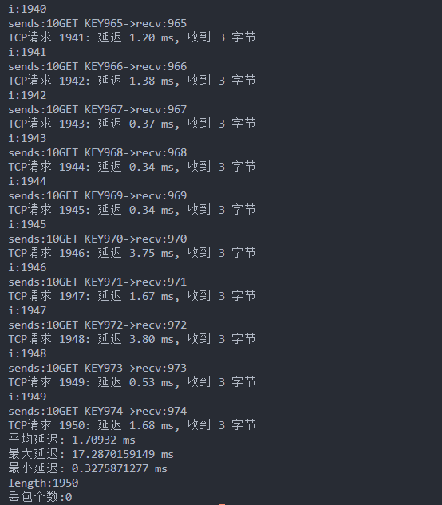
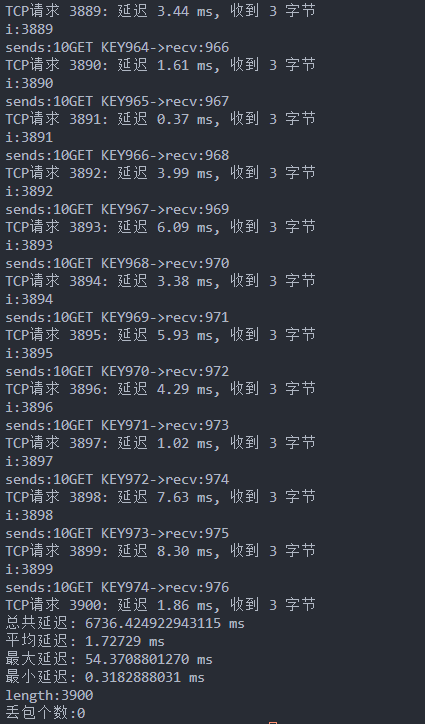
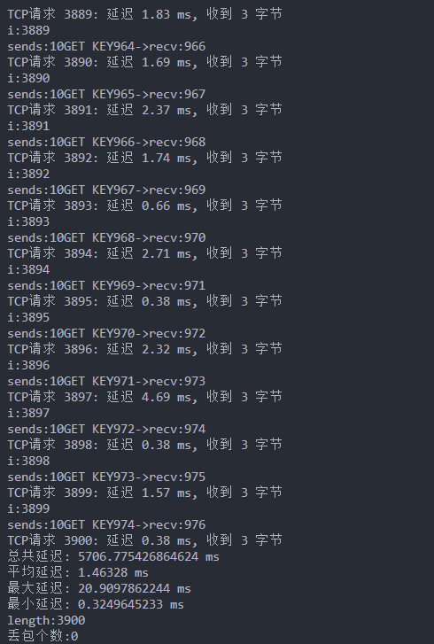
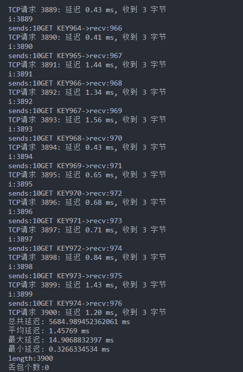

# kvstore

## 协议设计

>  4字节前缀长度(无符号) + 消息内容(长度与前缀长度相同)

实现了粘包和拆包情况时，服务器对于数据包的正确处理

## 代码设计

用一个大临时缓冲区接收网络数据，然后写入环形缓冲区，并处理数据。如果大缓冲区还存在未处理数据，那么继续循环写入环形缓冲区，再处理数据。

这里用对端的套接字来区分不同的用户，即不同的连接则对应不同的kv存储空间。如果当前请求的数据没有全部在环形缓冲区，那么将会到外层继续recv接收数据到大临时缓冲区，再把数据从大临时缓冲区尽可能读到(使用memcpy)环形缓冲区


每个连接最多存储1000个kv串，由于内存原因，再大一些，就会出现段错误例如10000.

连接结构体是局部变量并无数据的限制存储在栈上。每有一个连接到来，则会有一个局部连接结构体生成。用于当前连接(用户)存储kv键值对。

## 性能测试

​	在test_base目录中实现了python_test基本测试程序。有两个函数分别实现不同的测试逻辑

- tcp_client(self, num_requests=10)
  处理message 中的请求，每个请求重复执行num_requests次。
  计算的latency是某个请求执行时间的耗时，在执行了num_requestsh后还会计算对于该特定请求的平均延迟，最大延迟，最小延迟。**该函数主要用来测量*某一*具体的请求**。

-  tcp_client2(self)
  处理message中的请求。和上面的不同，只会直接按照其中的请求处理，不会重复。适合于测量批量请求(批量请求也可能是测量同一个函数接口，所以这两个函数有相交的部分)和交错耦合的请求
  整体来看2函数自定义程度更高，因为只按照请求处理，那么创建对应的请求数组就行。

  1. 
     测试975个不同的SET KEY和GET KEY
  
  ```python
  self.message = 
  [f"SET KEY{i} {i}" for i in range(975)] + \
   [f"GET KEY{i}" for i in range(975)]
  ```
  
  ​	message如上代码块
  
  ​	使用client2函数，测试结果如下图，供提供3张图。








​	可以发现总体耗时在1.5ms左右

  2. 

​	上面只有SET 和GET，现在 添加上重置操作并再次GET，也就是对已经存在的键调用SET但是对应的VALUE与存储的value不同

  ```python
self.message = [f"SET KEY{i} {i}" for i in range(975)] +        \
                        [f"GET KEY{i}" for i in range(975)] +           \
                        [f"SET KEY{i} {i + 2}" for i in range(975)] +   \
                        [f"GET KEY{i}" for i in range(975)]
  ```

​	测得下图:

​	







可以看到，平均延迟在1.5ms左右。

为了方便检查，服务端并未删除用于调试时的打印。总体来看在1.5ms左右。由于内存不够，每个连接最多存储1000个kv串，再大一些，可能会有段错误。